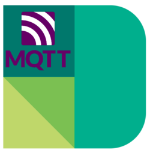

# tydom2MQTT

> **Deltadore Tydom to MQTT Bridge**

## Ready to go?
### Check out the [documentation](https://tydom2mqtt.github.io/tydom2mqtt/) to get started!

## Contact & Support

- Create a [GitHub issue](https://github.com/tydom2mqtt/tydom2mqtt/issues) for bug reports, feature requests, or questions
- Add a ⭐️ [star on GitHub](https://github.com/tydom2mqtt/tydom2mqtt) to support the project!

## Developer guide
[Please find here the developer guide](DEV.md)

## Changelog
[Please find here the changelog](docs/changelog/README.md)

## License

This project is licensed under the [MIT license](https://github.com/tydom2mqtt/tydom2mqtt/blob/master/LICENSE).
