# Installation TyDom2mqtt in Home Assistant with Mosquitto MQTT Brooker

> **tydom2mqtt:** \
`tydom2mqtt` can be integrated to [Home-Assistant](https://www.home-assistant.io/) in 2 distinct ways, directly or via Hass facility. I will only retrain the later as it's simpler for non developper.

Install the [`tydom2mqtt hass.io add-on`](https://github.com/fmartinou/hassio-addons/tree/main/tydom2mqtt)

Regardless the solution you choose, Home Assistant will automatically discover `tydom2mqtt` sensors using [MQTT Discovery](https://www.home-assistant.io/docs/mqtt/discovery/).

> **MQTT brooker:** \
As tydom2mqtt will run in a dedicated contrainer, you will most probably require an MQTT Brooker to interface with HomeAutomation and various MQTT sources in your system.
The classical solution is to use `Mosquito MQTT Brooker`

Install the `mosquito`

As Mosquito is available in the HomeAutomation official add-ons store, its installation is simplified. The following steps will get the add-on installed on your system:

1) Navigate in your Home Assistant frontend to \
**Settings** -> **Add-ons** -> **Add-on store**.
2) Find the "Mosquitto broker" add-on and click it.
3) Click on the "INSTALL" button.

For more information, please visit [`mosquito`](https://github.com/home-assistant/addons/blob/master/mosquitto/DOCS.md) Git Page

# Overall Configuration
## Create a valid HomeAssistant user
MQTT will requires a valid user name and password that is declared and valid in HomeAssistant. That user does not requires to have admin right.\
Some user names are reserved (e.g. homeassistant) and should not be used. I use 'mqtt-users' which is valid.
Those are declared in:\
Settings->People then Users Tab

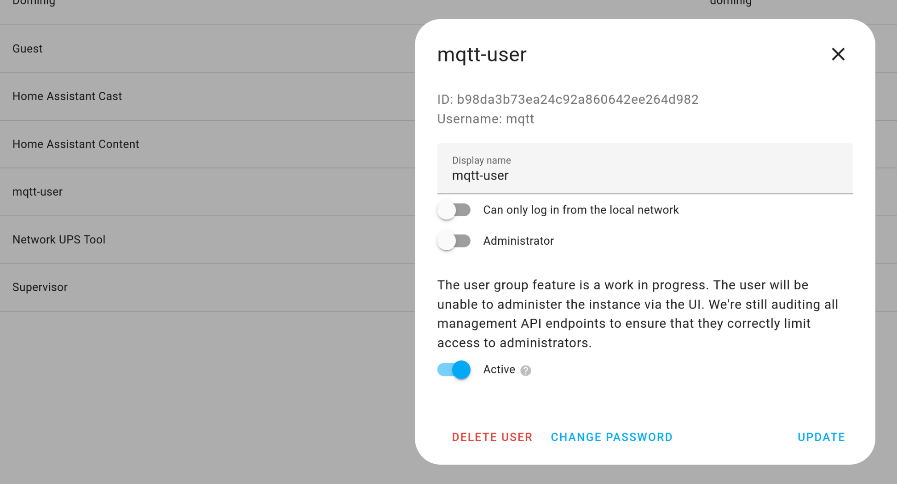

## Mosquitto, the MQTT Brooker
Mosquitto beeing availaible with the offical Add-ons store, you will find it easily. Just:\
Settings -> Add-ons\
**Note:** Add-ons are not the same as Integrations and are configured in different places.

Click on the Icon Add-on-store at the bottom right corner of the screen and you will get the following page.

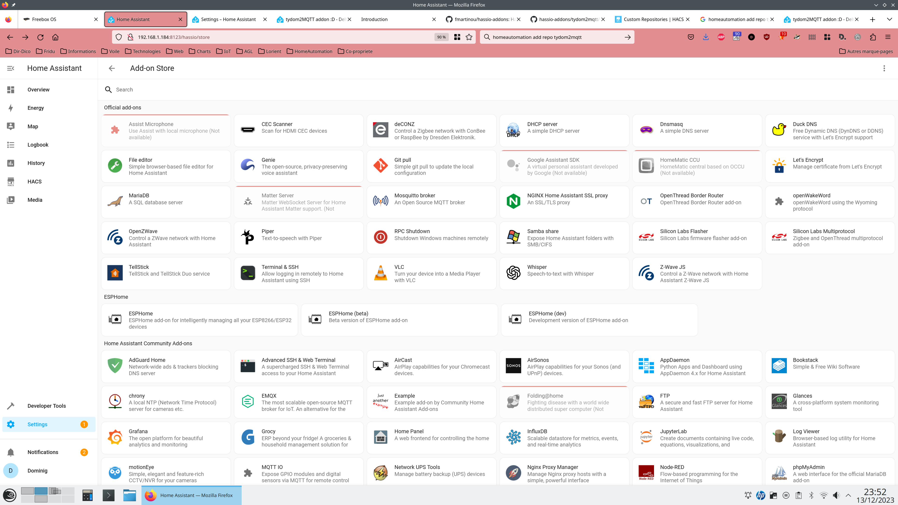

Locate and click the icon Mosquitto Brooker. You will get the following page. Just click **Install** link in the middle of the page.

Once the add-on installation is completed, you will find a configuration page.\
You will need to enter the user and password that were previously declared in HomeAssistant (People/users). The documentation can be confusing but without a valid user name it will not work.\
You can add complexity with more security. Often it's a good idea to get it working first and then complexify the setting. 

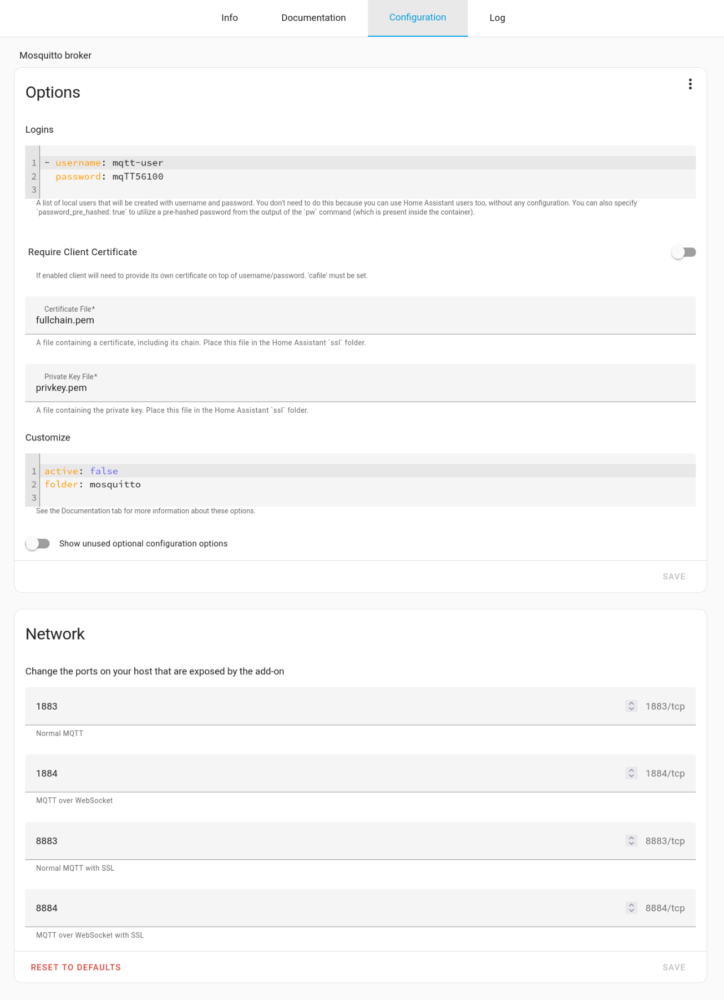

## tydom2mqtt
tydom2mqqt is not listed in the official store and is only visible once that you have added the repository (see install chapter on top).\
If you have the extra repository is correctly setup, you will see the following page.
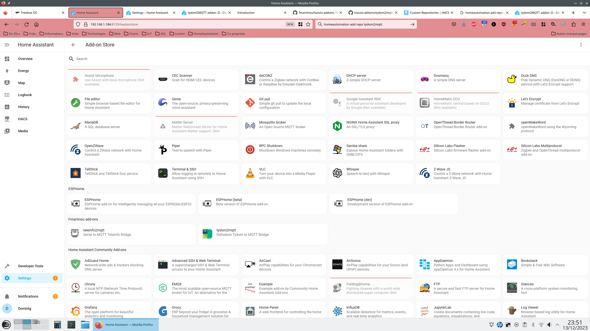

You can now install and configure tydom2mqqt.\
As tydom2mqqt will 'talk' to HomeAssistant via Mosquitto MQTT Brooker, we will need to setup our configuration accordingly.

 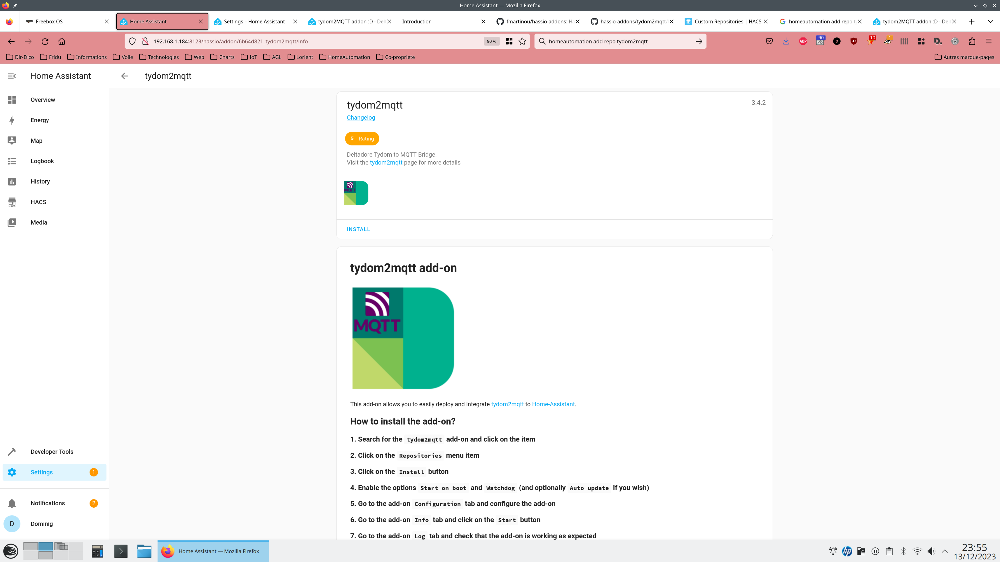
 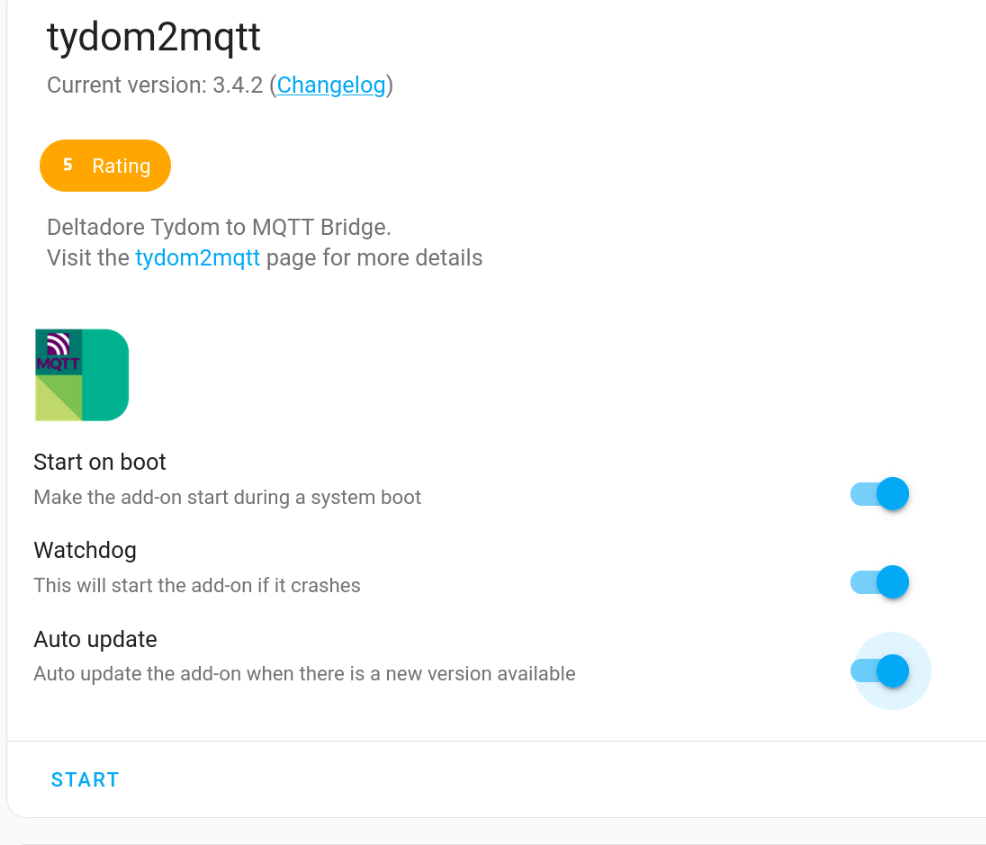
 You may want to start with debug level but you will need to remember to reduce the debug noise, once that your system works.\
 The MAC and IP adresses of your Tydom Gateway must be given. Note that your IP is given to the TyDom Gateway by DHCP, so ensure that your DHCP server will always serve the same address.

 ** The Tydom Gateway password can be a problem**\
 Older TyDom accept to connect without password, newer don't.
 Some people report that using the last 6 digits of the MAC address works, That was not my case and I had to ack the ssl connection to recover that password. I have documented the procedure which is not that simple but feasible.\
 [`TyDom password`](https://community.home-assistant.io/t/integrating-new-2023-tydom-deltadore-x3d-zigbee-gateway-with-home-assistant-solved/537503) HowTo

Other configuration entries are self explanatory. You will need to give the same user name and password as for Mosquitto.
A bug requires to setup a PIN for the Alarm even if you do not have an alarm, any 6 digits number will do.

 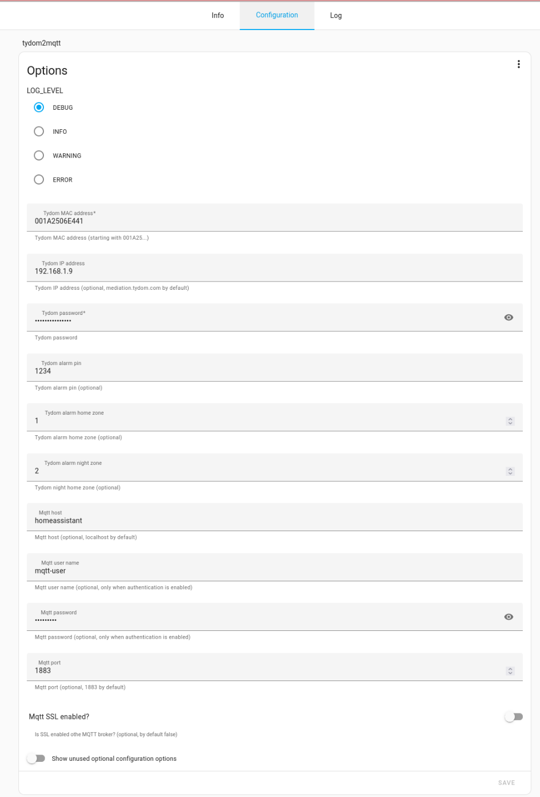

 ## MQTT in HomeAssistant
 In the integration (**not** in the add-on-store)\
 Settings->Devices&Services - Integrations Tabulation\
 You will find the MQTT integration provided by default by Home Assistant. This is an MQTT client that will connect to a Brooker (Mosquitto) to receive MQTT messages to make them available to HomeAssistant.\
 **Note: ** It helps (a lot) debugging, would it later be required, to create an easy to read Client-ID rather than to leave the system create a random ID.
 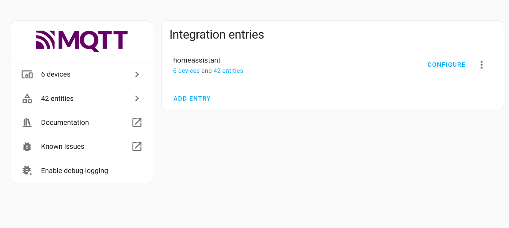
 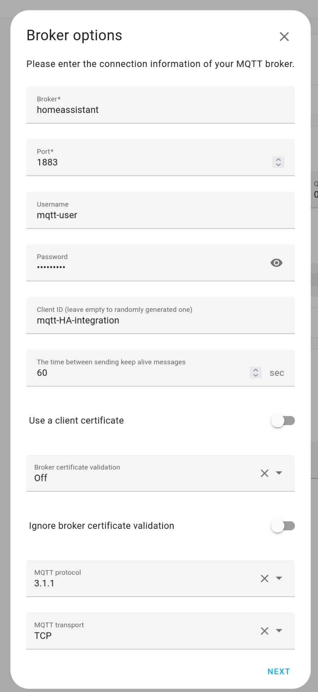
 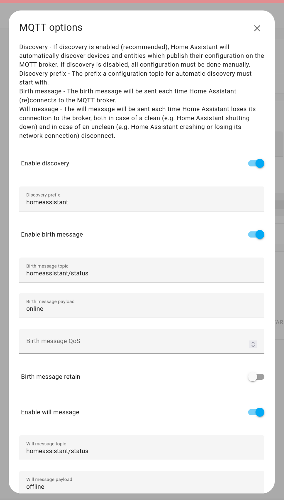

 **your config is done and after a restart your system should be up and presenting the TyDom devices as entities and devices**

  ## Debug
  If your system does not present any TyDom devices in HomeAssistant, something has gone wrong. The easier is to debug following the data chain.\
  1) Can tydom2mqtt connect to the TyDom Gateway?
  2) Can tydom2mqtt connect to the Mosquitto Broker?
  3) Can HomeAssistant MQTT integration connect to Mosquitto Brooker.

  Start by checking that the corresponding docker containers are up and running. From the host / HomeAssistan console you should see something like this :\
  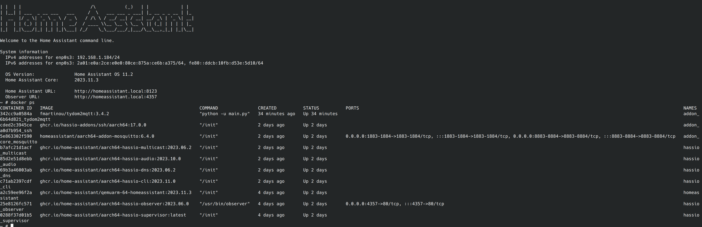
  The tydome2mqtt and mosquito add-ons should be up and running.

  ### tydom2mqtt
  From Settings->Add-ons->TyDom2MQTT - Log tabulation\
  You can see the log of tydom2mqtt service.\
  You may want to restart the service in order to get a debug of the initial and interresting phases.\
  Setting->Adds-ons-TyDom2MQTT - Info Tabulation\
  What is important, is checking that your configuration is accepted as correct and that the connection to TyDom2 Gateway is working.

  Errors in configuration are simple to correct, you just need to comply to the documentation (except for the Alarm that must have a PIN even if you do not have an Alarm)

  Connection to Mosquito MQTT Brooker should also be OK but connection failure could also come from Mosquitto. Check that the the host name is valid and correct. As you run in independant containers 'localhost' will always fail. The default hostname 'homeassistant' should work for most standard systems.\
  The second typical error is an incorrect user:password configuration or lack of creation of the user name in HomeAssitant 'People' Menu Entry, Users Tabulation.\
  **Note:** Some user name are reserved and cannot be used. mqtt-user is a valid user name and would work.

  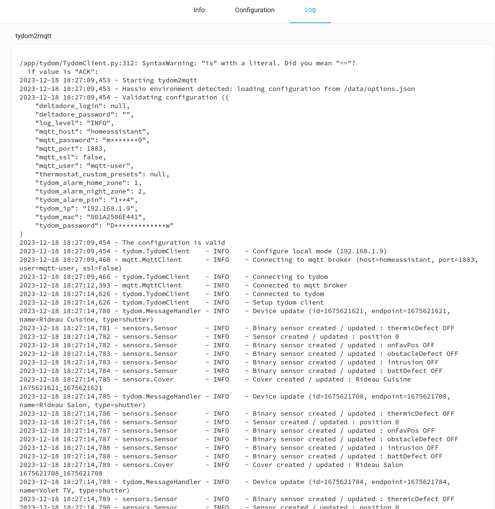

  ### mosquitto
  You will access to the Log with the same method as with tydom2mqtt described above.\
  Would any configuration error be present, they would be reported at the startup of the Log.\
  As you run in a Container, the Warning about running as root can be ignored.\
  The IP address can be of interrest to configure other services would the default 'homeassistant' be incorrect in your setting.\
  What you want to check is that tydom2mqtt and mqtt-HA-integration have succedeed to connect. This is where using a readeable MQTT ID helps.\
  You can later add extra security would your system requires it. Go step by step and use the same debug technique to progress toward a safe completion.\
  **Note: ** My log shows that other service try to connect and are rejected. These are auto discovery services that I have not configured (user name and password) because I do not need them.

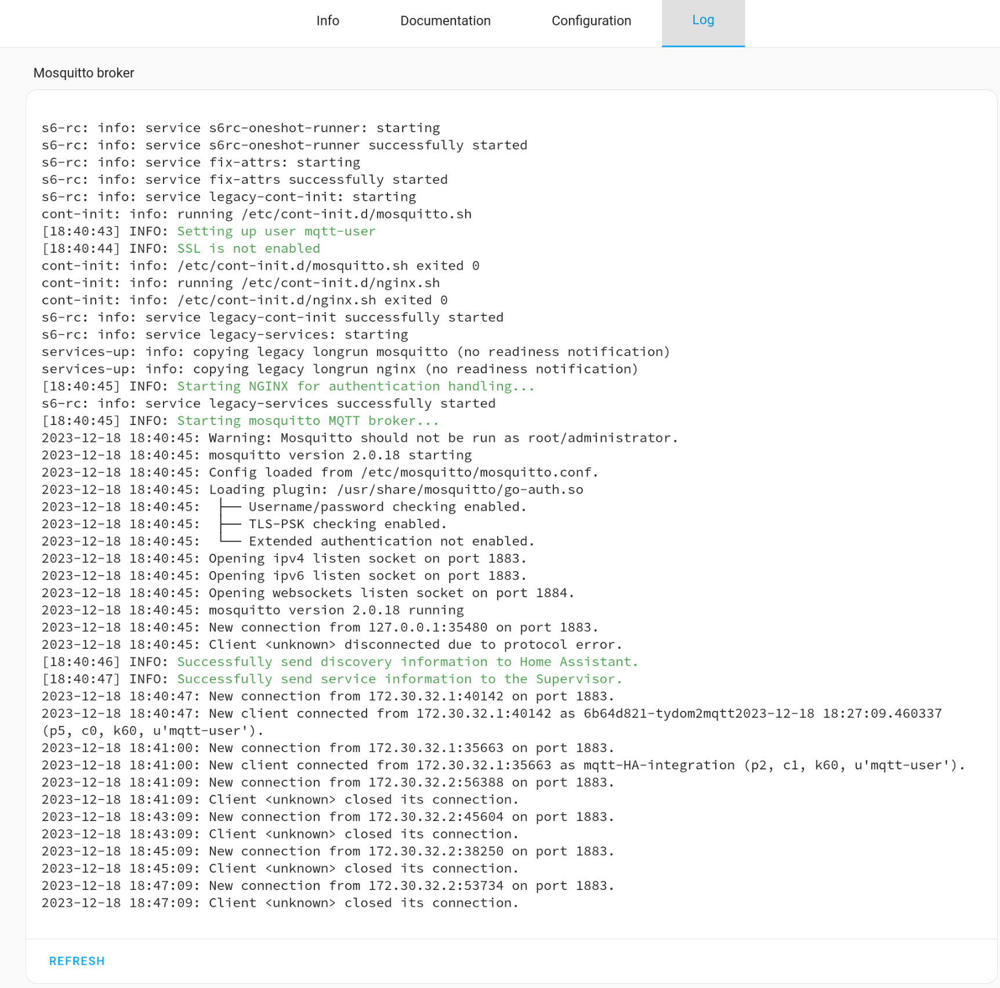
  ### HomeAssistant MQTT integration
Access to the Debug Log is different as this is a internal HomeAssistant service. The configuration and log are on the service page.\
Settings->Devices&Services Click MQTT Icon

From there you can check which devices and entities are listed. You should see your TyDom devices discovered by MQTT listed.\
If not you will need more debugging.

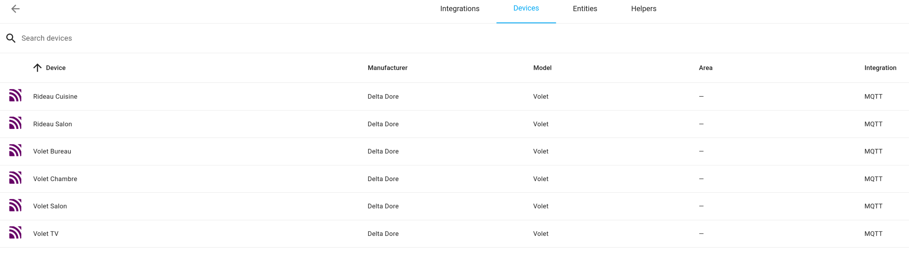

To access MQTT debug you will need to activate the debug. This is done from the landing page after click on the MQTT Icon. See last Menu Item "enable Debug loggin" on the Left side of the GUI.\
Then you need to reload the configuration. This done by opening a submenu by clicking the vertical "..." on the right up corner of the GUI.
1) Reload
2) Download diagnostic.
3) Open Log File in a text Editor.\
The interresting part starts around line 70. You should see the connection to the MQTT Brooker (Mosquitto) and then the Devices Discovery.

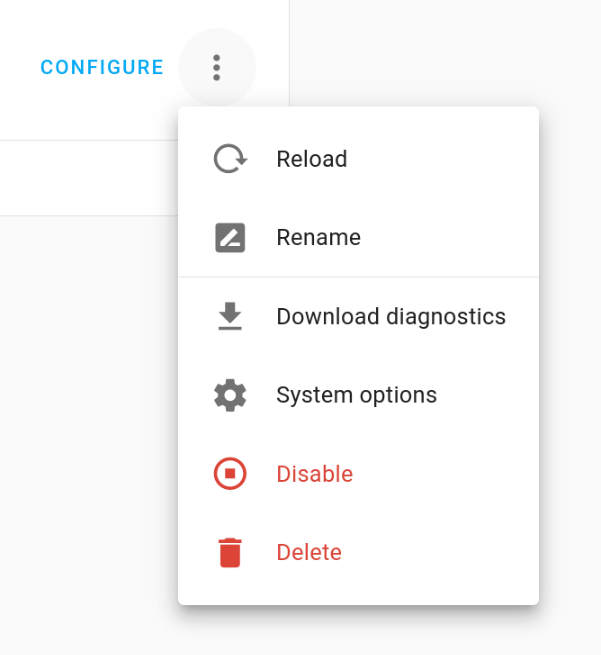

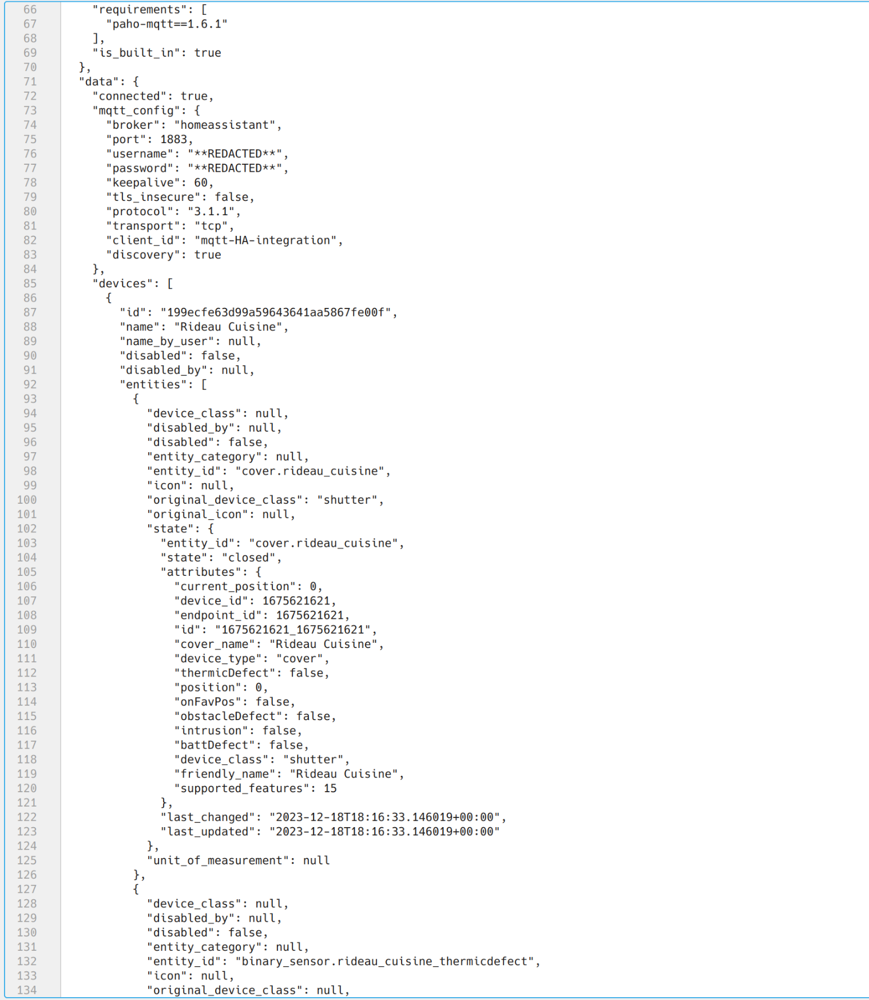
## If more debug is required
You can install the add-on MQTT Explorer.\
This is not an official HomeAssistant Add-on and it will require to be installed like Tydom2MQTT add-on.\
[`MQTT Explorer`](https://community.home-assistant.io/t/addon-mqtt-explorer-new-version/603739) Home Page

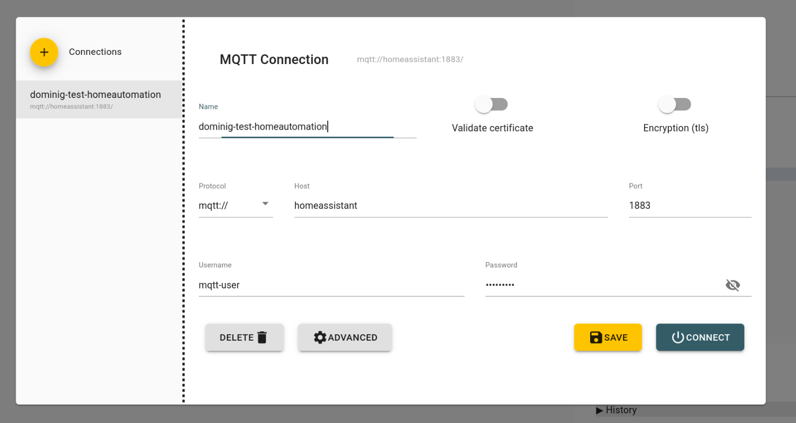
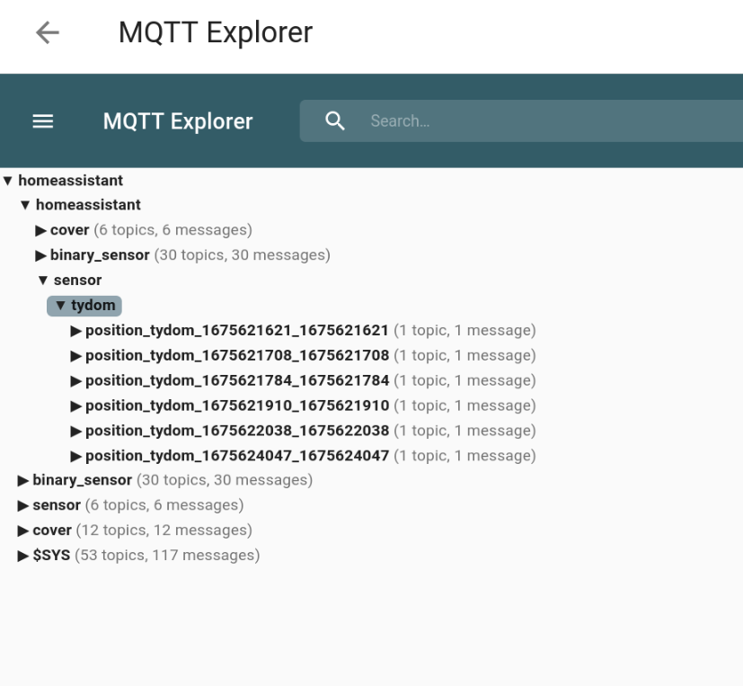
## Backingup of your configuration
Once that your system works you want to backup it.\
**Note: ** HomeAssitant back will **not** backup the configurations of the Add-ons.
The only efficient technique is to create Docker container snapshoots or a VM snapshot would you run in a VM.\
If you do not have previous running snapshots, note that you will need to erase the HomeAssistant MQTT Integration configuration after restoring the HomeAssistant standard (automatic) backup.\
Such restauration will create new ID for devices what will impose a manual update of your automations and scripts using those devices.

**ToDo**
Write a procedure to snapshoot HomeAssistant Docker Containers.\
[`Docker` Snapshot Creation Tips](https://stackoverflow.com/questions/22378777/how-to-take-container-snapshots-in-docker)
