# Home Assistant integration

!> **For more information, please visit the [Home-Assistant mosquito integration page](https://github.com/home-assistant/addons/blob/master/mosquitto/DOCS.md).**

`tydom2mqtt` can be integrated to [Home-Assistant](https://www.home-assistant.io/) in 2 distinct ways.

?> Regardless the solution you choose, Home Assistant will automatically discover `tydom2mqtt` sensors using [MQTT Discovery](https://www.home-assistant.io/docs/mqtt/discovery/).

## Solution 1: Deploy the docker image by yourself
Just run the container [as described here](/introduction/).

## Solution 2: Install the [`tydom2mqtt` hass.io add-on](https://github.com/fmartinou/hassio-addons/tree/main/tydom2mqtt)

?> [Please find here the Community Home-Assistant `tydom2mqtt` thread](https://community.home-assistant.io/t/tydom2mqtt-delta-dore-custom-component-wip/151333).

### Installation to Home Assistant + `mosquitto` MQTT Broker

?> **MQTT broker** \
To establish the communication between `tydom2mqtt`  and Home-assistant, you need an mqtt broker;
[`mosquitto`](https://mosquitto.org/) is the most recommended one. 

### Create an mqtt user
The mqtt broker requires credentials.

That user does not require to have admin rights.

Some user names are reserved (e.g. `homeassistant`) and should not be used (you can use `mqtt-user` for example).

To create a new user, go to **_Settings_** -> **_People_** then **_Users Tab_**

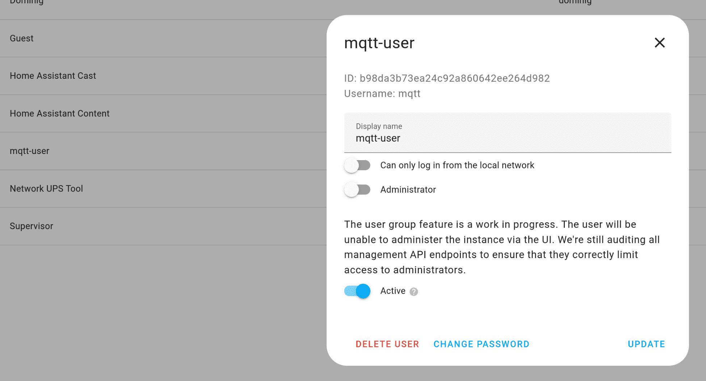

### Install mosquito

You can install mosquito using the Home-Assistant official add-on:
1. From Home-Assistant UI, navigate to **_Settings_** -> **_Add-ons_** -> **_Add-on store_**
2. Find and select the **_Mosquitto broker_** add-on
3. Click on the **_INSTALL_** button

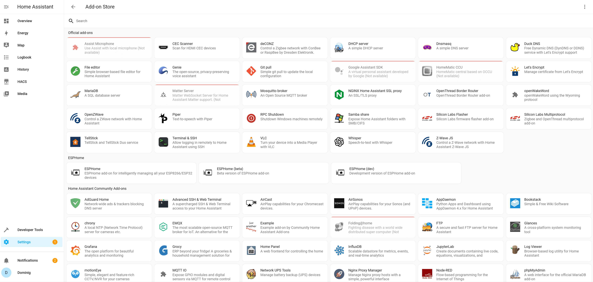

?> Please notice that the Add-ons are separated from the Integrations.

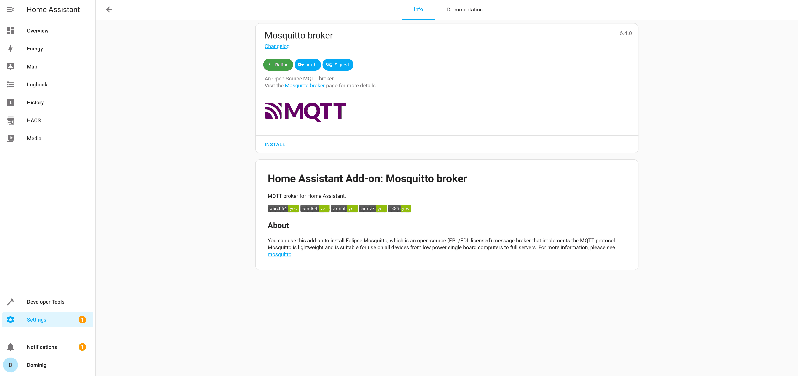

### Configure mosquito

Once the add-on installation is completed, you can configure it from its **_Configuration_** page.

You need to enter the mqtt credentials you've just created in Home-Assistant. \
(the documentation can be confusing but it won't work without a valid user name)

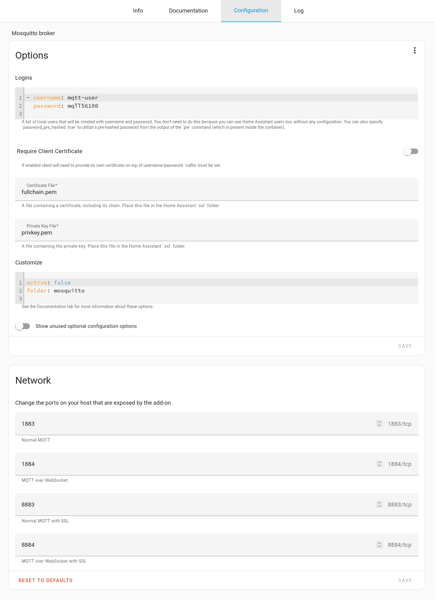

### Configure home-assistant mqtt integration

In the integration page, go to **_Settings_** -> **_Devices & Services_** -> **_Integrations Tab_**\

You'll find the mqtt integration provided by default by Home-Assistant.

This is an MQTT client that will connect to your mosquitto broker to receive mqtt messages to make them available to Home-Assistant.

?> It helps (a lot) debugging to create an easy to read Client-ID rather than leave a default random ID.

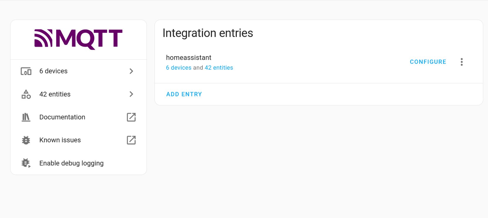

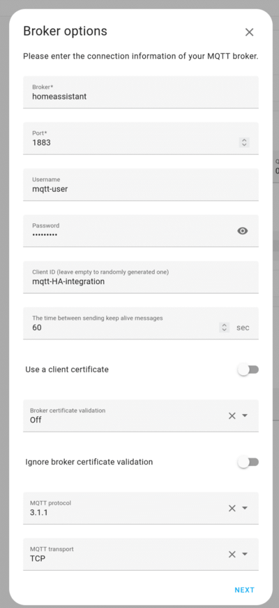

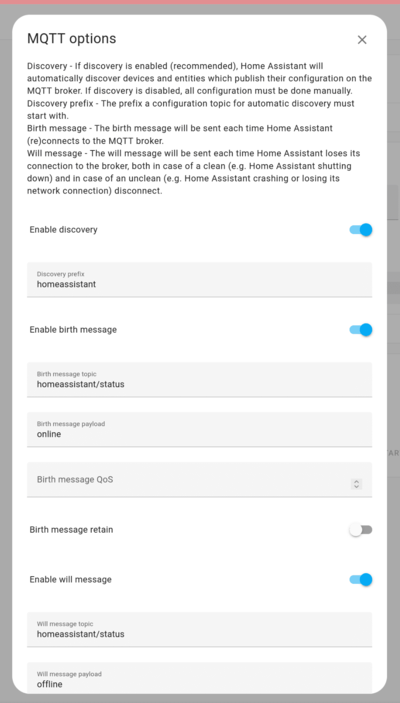

### Install tydom2mqtt

`tydom2mqqt` is available via an extra addon repository.

To add the repository to your Home-Assistant, just [follow the documentation here](https://github.com/fmartinou/hassio-addons/tree/main).

Then you can install `tydom2mqtt`.

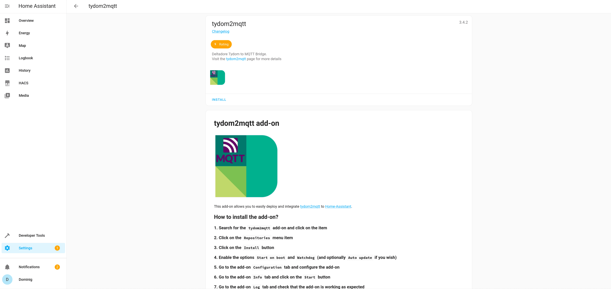

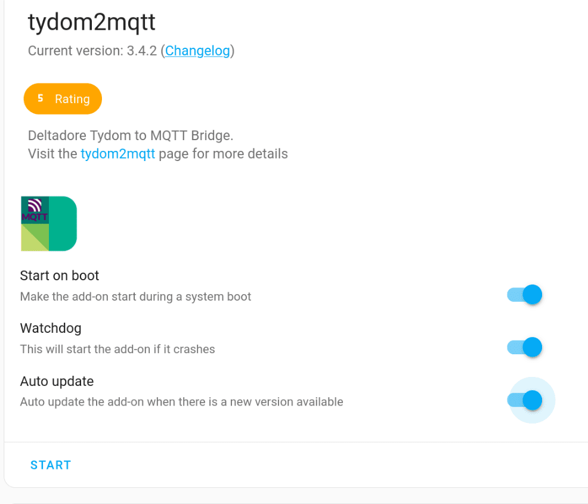

### Configure tydom2mqtt

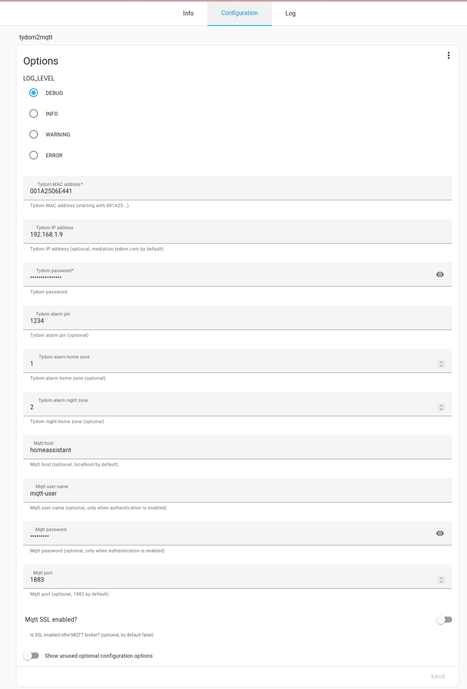

?> Mqtt broker host is `homeassistant`. \
(as you run this add-on as an independent container, `localhost` won't work)

?> Other configuration entries are pretty self-explanatory.

?> You may want to start with `debug` level logs to help you troubleshoot. \
Once your system is working, change it to `info` to reduce the log volume.

?> Tydom IP address is likely attributed by your DHCP server; please configure a static address to avoid any change in the future.

?> Tydom Gateway password can be a problem! \
Older Tydom gateways accept to connect without password, newer don't. \
Some people report that using the last 6 digits of the MAC address works, so others don't. \
Here is a (not simple but feasible) [`tutorial to get your tydom password`](https://community.home-assistant.io/t/integrating-new-2023-tydom-deltadore-x3d-zigbee-gateway-with-home-assistant-solved/537503).

?> A bug requires you to setup an Alarm PIN even if you don't have one; any 6 digits number will do the trick.

### Restart tydom2mqtt

After configuring the addon, don't forget to restart it.

Then Home-Assistant should have discovered your Tydom devices and entities.

### Troubleshoot

If Home-Assistant doesn't discover your Tydom devices and entities, try to debug step-by-step:

1. Can `tydom2mqtt` connect to the Tydom Gateway?
2. Can `tydom2mqtt` connect to the Mosquitto Broker?
3. Can `Home-Assistant` mqtt integration connect to the Mosquitto Broker?

Start by checking that the `tydom2mqtt` and `mosquito` containers are up and running.

From the host / Home-Assistant console you should see something like:

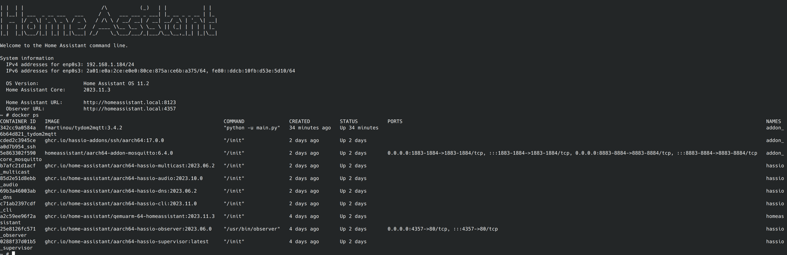

#### Troubleshooting `tydom2mqtt` errors
From **_Settings_** -> **_Add-ons_** -> **_Tydom2mqtt_** -> **_Log_**:

You can see the logs of `tydom2mqtt`

?> You may want to restart the service to get logs about the startup phase.

?> The important point is to check that your configuration is valid and that the connection to your Tydom Gateway is working.

?> Connection errors to the mosquitto mqtt Broker could also be caused by mosquitto misconfiguration.

?>  Check that the mqtt broker host name is valid and correct.

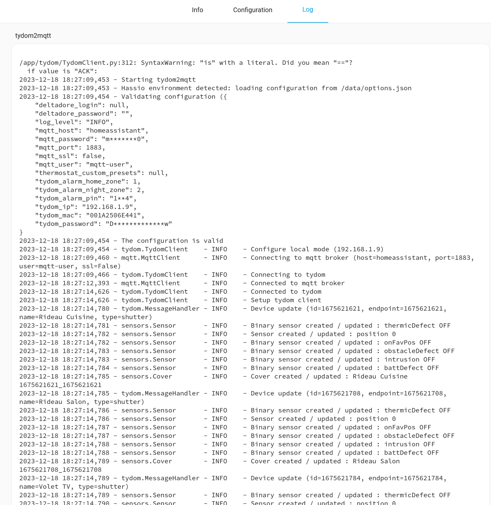

#### Troubleshooting `mosquitto` errors

Check the logs of your `mosquitto`add-on.

?> If any configuration error occurs, it will be reported at startup

?> As you run mosquitto in a container, the warning about __running as root__ can be safely ignored

?> The reported IP address is crucial to configure the other services and should default to `homeassistant`

?> To ensure `tydom2mqtt` can connect to `mosquitto`, you should find your __Mqtt Client ID__ in your logs

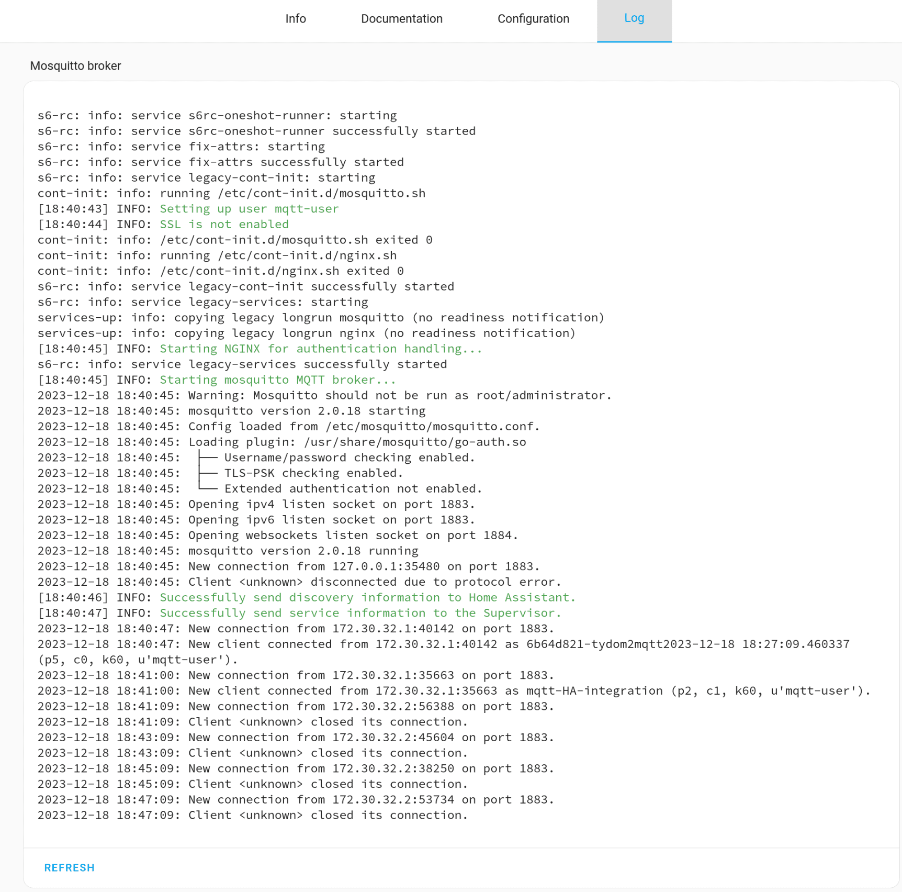

#### Troubleshooting Home-Assistant Mqtt integration errors

Go to **_Settings_** -> **_Devices & Services_** and click to the Mqtt Icon

You can there check which Tydom devices and entities have been discovered.

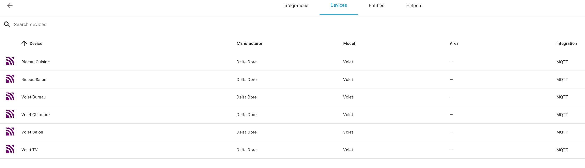

If not, you need more debugging.

To enable mqtt debug mode, you need to activate the debug from the landing page (see the last menu item **_Enable Debug logging_** on the left side of the GUI.

Then you need to reload the configuration (by clicking the vertical **_..._** on the right up corner of the GUI).

1. Reload
2. Download diagnostic
3. Open Log File in a text Editor.

The interesting part starts around line 70; you should see connection details to the mqtt broker and then the device discovery.

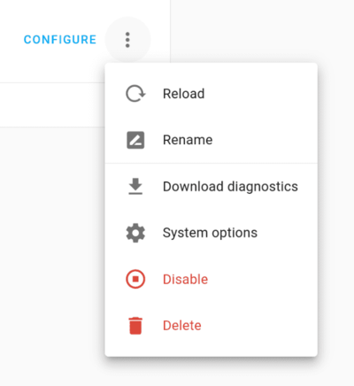

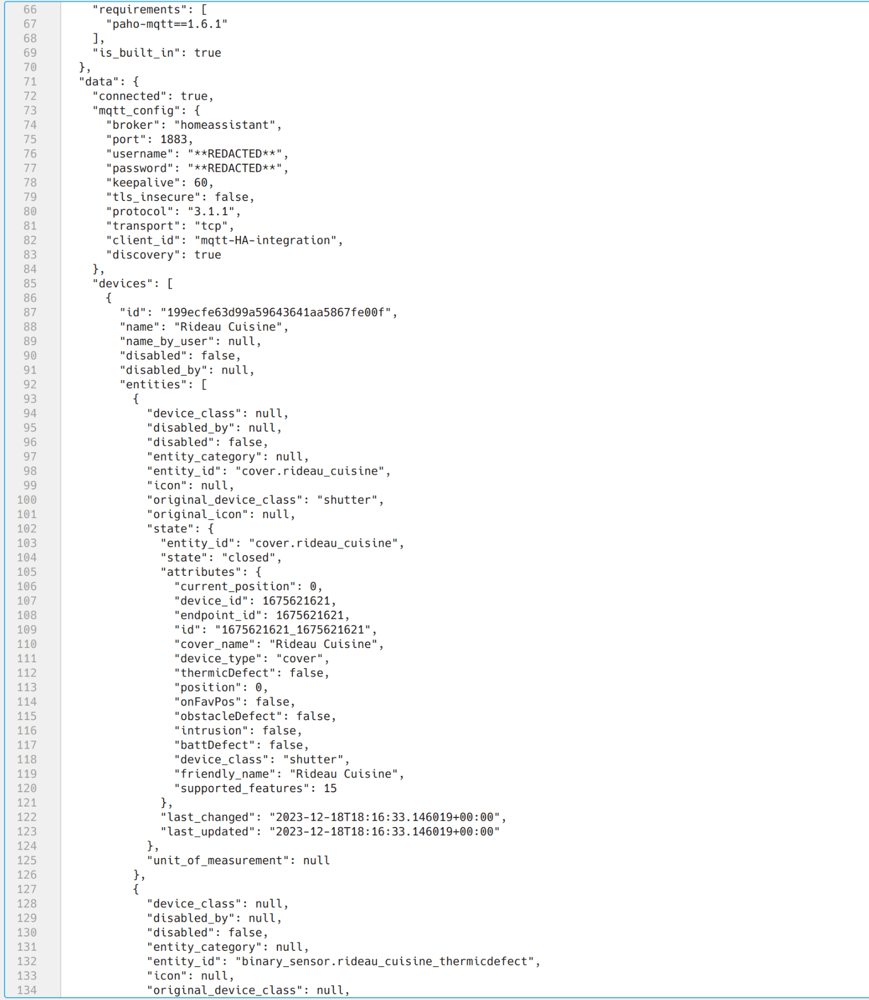

#### Troubleshooting Mqtt messages

You can install the MQTT Explorer add-on by following the [installation documentation here](https://community.home-assistant.io/t/addon-mqtt-explorer-new-version/603739).

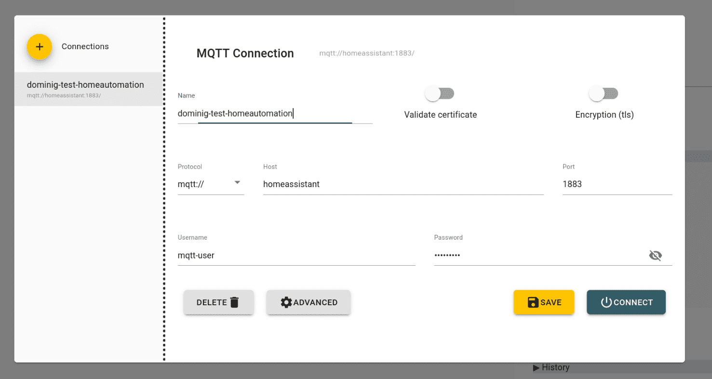

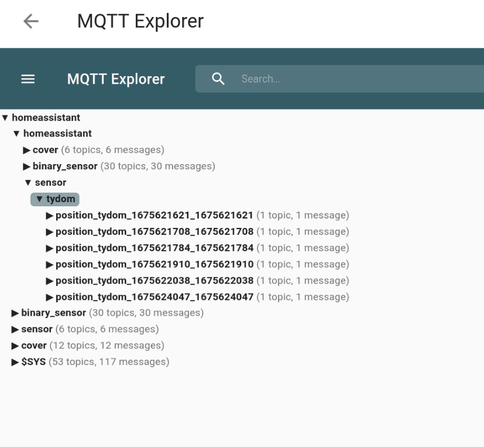

#### Configuration back-up

Once that your system is working you're encouraged to back it up.

?> Home-Assistant does not backup the add-on configurations.

The more efficient ways are to create Docker container snapshots or VM snapshots.

?> [You can get some inspiration from there](https://stackoverflow.com/questions/22378777/how-to-take-container-snapshots-in-docker).
